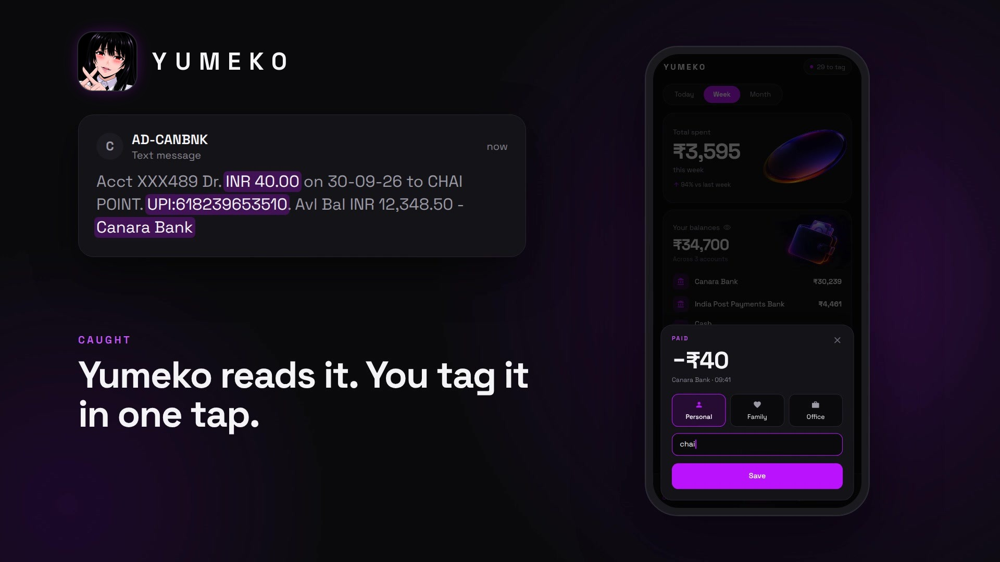

# Yumeko



**Your bank texts you after every UPI payment, and you never read it. Yumeko does.**

Yumeko is an Android expense tracker that reads your bank's SMS alerts and your payment apps' notifications, catches each payment the moment it happens, and pops up over whatever you're doing so you can tag it in one tap. Everything stays on your phone: no account, no server, no sync.

> The repository is called `penny`; the app is called Yumeko.

## What it does

- **Catches payments automatically.** Listens for bank SMS (Canara, SBI, HDFC, ICICI, Axis, Kotak, IPPB and more) and for notifications from UPI apps (Google Pay, PhonePe, Paytm, BHIM, CRED, Samsung Wallet and others). This also covers small UPI transfers your bank sends no SMS for.
- **Tags in one tap.** A popup appears over any app with the amount and bank. Pick Personal, Family or Office (or your own categories) and type what it was for.
- **Tags itself from your words.** Type "chai" and the payment is tagged Cafe; "petrol" becomes Fuel, "xerox" becomes Printing.
- **No double counting.** When the SMS and the app notification both report the same payment, they're merged into one, matched by UPI reference or by amount and time.
- **Shows where the money went.** Today, week and month totals, a spending curve, spending by tag and by account, and balances that use the bank's own figure when the SMS includes one.
- **Lets you get paid back.** Add your UPI ID in Profile, then the centre button makes a QR for any amount and reason that you can show or share.
- **Home-screen widgets.** *Today* shows what you've spent today against your daily average plus how many payments are untagged. *Receive QR* puts your UPI QR on the home screen.
- **Exports your data.** CSV (ready for Notion or Sheets) or Excel, whenever you choose.
- **Light and dark themes.**

## Privacy

Everything lives in a SQLite database on the phone. Nothing is uploaded and there is no login. Data only leaves the phone when you export it or share a QR yourself. Android backups are turned off for the app.

## Install

Yumeko is Android-only and installed by sideloading the APK; it isn't on the Play Store. iPhones can't run it, because iOS doesn't let apps read SMS or other apps' notifications.

1. Get the latest APK (CI builds one on every push to `dev`), or build it yourself (below).
2. Install it and open the app. Tap **Turn on** when asked to watch for transactions.
3. Grant these:
   - **SMS:** to read bank alerts.
   - **Display over other apps:** for the tagging popup.
   - **Notification access** (optional): to catch payments your bank doesn't text you about.

## Build from source

You need Flutter (CI uses 3.44.8) and a JDK. Android Studio's bundled one works.

```bash
flutter pub get
flutter test
JAVA_HOME=/path/to/android-studio/jbr flutter build apk --release --split-per-abi
```

The arm64 APK is at `build/app/outputs/flutter-apk/app-arm64-v8a-release.apk`.

To try the interface in a browser with sample data (no phone needed):

```bash
flutter run -d chrome -t lib/preview_main.dart
```

## Project layout

```
lib/
  main.dart            app entry point and the tagging popup (overlay)
  preview_main.dart    browser preview with in-memory sample data
  models/              Txn, Category, Account, Profile
  screens/             Overview, Transactions, Insights, Profile
  widgets/             tagging card, add sheet, receive QR sheet, charts
  services/
    sms_parser.dart        bank SMS and payment-notification parsing
    sms_capture.dart       SMS listener (works with the app closed)
    notification_capture.dart  payment-app notification listener
    capture.dart           saves a capture and raises the popup
    transactions_db.dart   SQLite storage and de-duplication
    analytics.dart, accounts.dart, tags.dart   totals, balances, tag rules
    upi.dart, home_widgets.dart, export_csv.dart
android/app/src/main/kotlin/   home-screen widget providers
test/                          unit and widget tests
integration_test/              on-device database tests
```

## Tests

```bash
flutter test                                              # unit and widget tests
flutter test integration_test/on_device_test.dart -d <id>  # on a phone
```

The on-device test uninstalls the app when it finishes, which deletes its database. Don't run it on a phone with transactions you want to keep.

## More

[roadmap.md](roadmap.md) has the design decisions, device notes and the known plugin workarounds.
